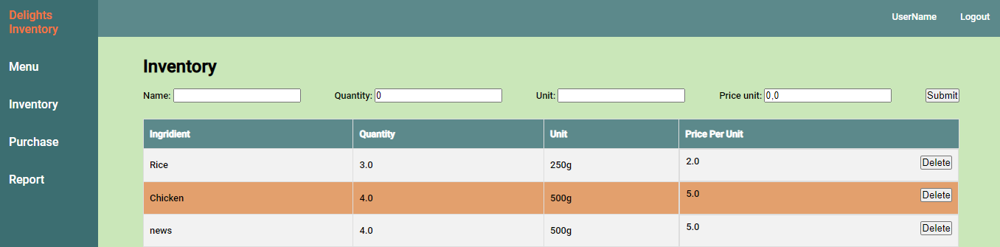
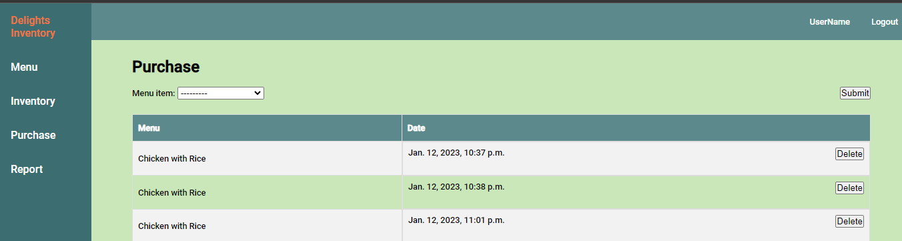

# Delights-Inventory

This is a project called Delights-Inventory, built using Django, HTML, and CSS. The purpose of this project is to provide a platform for managing a menu, inventory, and purchases for a restaurant or food establishment.

The project offers an intuitive user interface with the following key features:

- **Menu Page**: Allows customers to browse and select from a wide range of delicious dishes available on the menu. The menu page supports CRUD operations, enabling seamless management of menu items.

- **Inventory Page**: Provides an inventory management system that tracks the ingredients used in various dishes. With built-in CRUD functionality, it simplifies the process of managing and replenishing inventory.

- **Purchased Page**: Enables customers to place orders and make purchases directly from the menu. The page includes validation mechanisms to ensure that orders can only be placed when sufficient ingredients are available. Additionally, it maintains a detailed history of all purchases made.

## Getting Started

To get started with the Delights-Inventory project, follow these instructions:

1. Clone the repository:

```
git clone https://github.com/JPCLima/Delights-Inventory
```

2. Install the necessary dependencies by running

```
pip install -r requirements.txt.
```

3. Set up the database by running the migrations:

```
python manage.py migrate
```

4. Create a superuser account:

```
 python manage.py createsuperuser
```

5. Start the development server:

```
python manage.py runserver.
```

6. Access the project by opening a web browser and navigating to

```
http://localhost:8000/
```

## Screenshots

Here are some screenshots that provide a visual preview of the Delights-Inventory project:

Menu Page
[](assets/Screenshot_1.png)

Inventory Page


Purchased Page

